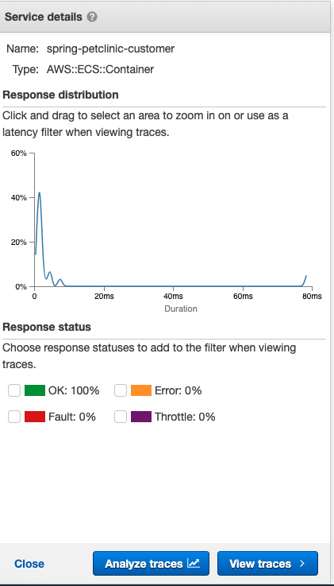
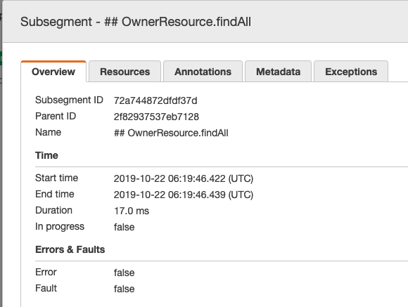

# Welcome to Spring Petclinic Serverless with X-Ray!

This is a project for Python development with CDK. And you must have meet [requirement](../README.md#prerequisites) before to start below.

## Deploy the Spring Petclinic Serverless X-Ray Stack

First of all we need create the Spring Boot deployment JAR using:

```bash
cd spring-petclinic-serverless && ./mvnw package
```

We also need manually create a virtualenv on MacOS and Linux in this project root folder:

```bash
$ cd ../ && python3 -m venv .env
```

After the init process completes and the virtualenv is created, you can use the following
step to activate your virtualenv.

```bash
$ source .env/bin/activate
```

Once the virtualenv is activated, you can install the required dependencies.

```bash
$ pip install -r requirements.txt
```

At this point you can now synthesize the CloudFormation template for this code.

```bash
$ cdk synth
```

After review the CloudFormation template you can create the Docker Image which will upload to ECR Repo and deploy all the Infracture codes using:

```bash
$ cdk deploy
```

## Have a Tutorial with X-Ray

Copy the `cdk deploy` output `serverless-xray-stack.FagatePetclinicWebsiteUrl ` to the Web browser and enter in the Petclinic App.

To visit `Owner` page:


And click more links to access more services:


After some time you can login [X-Ray Console](https://console.aws.amazon.com/xray/home) to view:

Service Map:


Service Detail:



Traces Detail:


Segment:


Subsegment:



Analytics:

